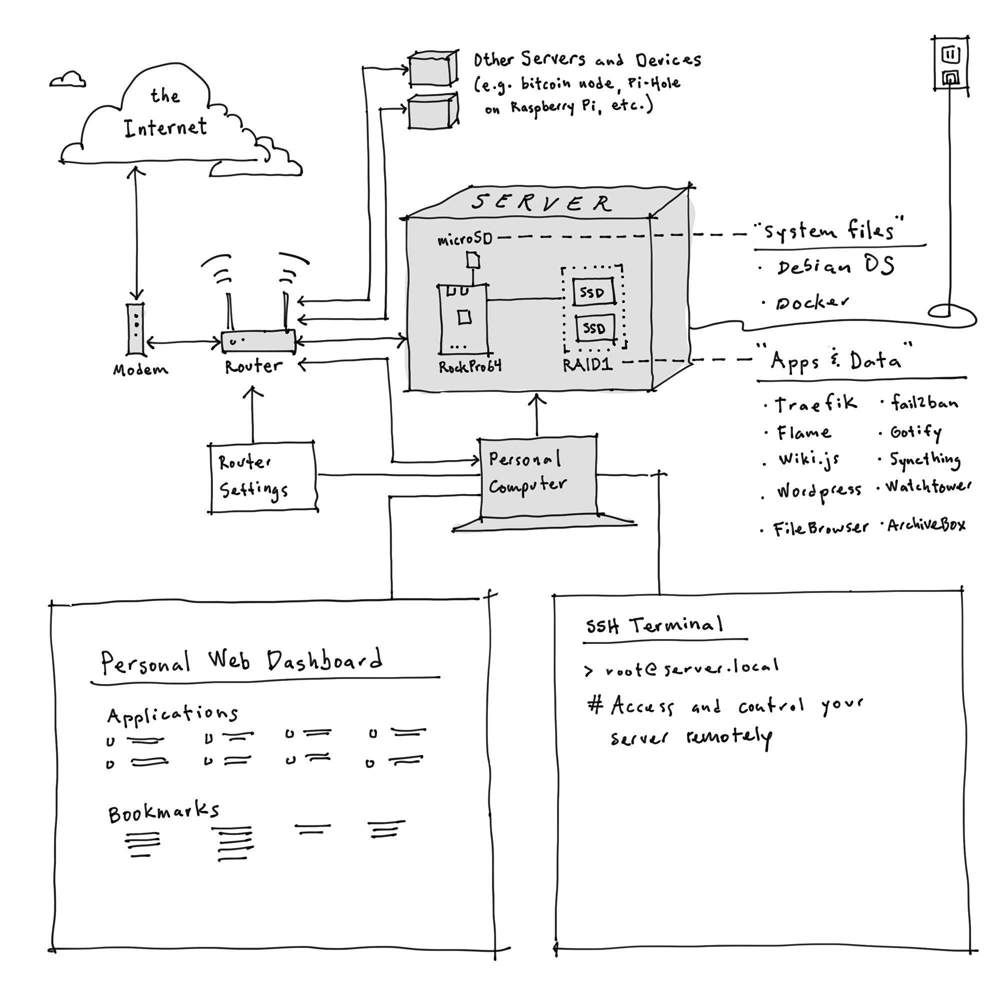

# RockPro64 Simple Server

**This is a plain-language, step-by-step guide for the computer novice wanting their own cloud**, looking to declare independence from Google and its ilk, save on monthly hosting fees, or just learn a new skill.

## Who is this guide for?
**This guide is intended for the novice coder**, the non-technical-yet-curious, or the Linux greenhorn; those of us looking for an escape route from Big Tech with better privacy and personal sovereignty. If you are one of those people, this guide is for you. It will hold your hand at each step while you spin up your own server with the other.

For more on the **Design Principles** behind this Server, see [Appendix I](Appendix-i-Principles.md).

While only basic computer skills are required to get through this guide, it's best if you already know the following (or acquire the skills elsewhere):

1. How to access and adjust your home router settings.
2. Good password management. This is a critical best practice, especially when you're taking full custody and responsibility for your data.
3. Willingness to work with tedious text details and patience to deal with errors that are frustratingly stupid in hindsight.

## Project Background
This project began after I temporarily lost access to some bitcoin on a lightning wallet I had set up on a Raspberry Pi 4. It was a "plug-and-play" node which meant it was easy to set up, but after I encountered the problem I quickly realized I had no idea what I was doing. I spent a lot of time on forums, DuckDuckGo, and YouTube, trying to decipher all the command-line-speak. After a while I figured out it was a hardware issue (likely the USB ports on my Raspberry Pi, or perhaps the external drive itself). After much headache and heartache I recovered my funds. With hard money on the line I figured I had better learn how to manage it under the hood (holding your own bitcoin is like driving a motorcycle alone across the desert: you better know what you're doing). That experience set me on a path to learn more about computers, servers, and coding, to better prepare myself for the inevitable upgrades and potential failures. In that process, I realized I could apply my new skills to build my own server. This guide is the result.

I didn't study computers in college and don't work with them professionally. It's a pandemic hobby. Approach this guide with a healthy bit of skeptism; don't trust: verify.

## Table of Contents
Follow the steps below. Once you arrive at Step 04, you will reference the above folder which each contain the necessary files for installing the apps.
* [Step 01: Acquire and Assemble the Hardware](01-Acquire-and-Assemble-Hardware.md)
* [Step 02: Install Debian OS](02-Install-Debian-OS.md)
* [Step 03: Install Docker](03-Install-Docker.md)
* [Step 04: Install the Applications](04-Install-Applications.md)
* [Step 05: Backup Data and Power](05-backup-data-and-power.md)
* [Appendix I: Principles](Appendix-i-Principles.md)
* [Appendix II: Troubleshooting](Appendix-ii-Troubleshooting.md)
* [Appendix III: Adding More Apps and Devices](Appendix-iii-Adding-Apps-or-Servers.md)

***
*The framework and much of the content for the Applications section of this guide was drawn from [https://github.com/BaptisteBdn/docker-selfhosted-apps](https://github.com/BaptisteBdn/docker-selfhosted-apps).*
